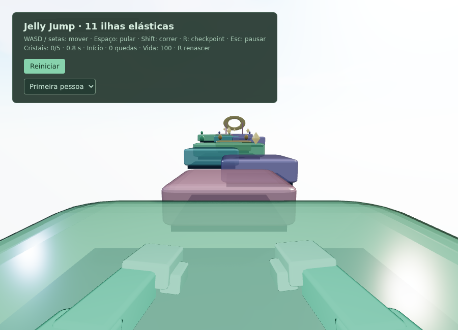
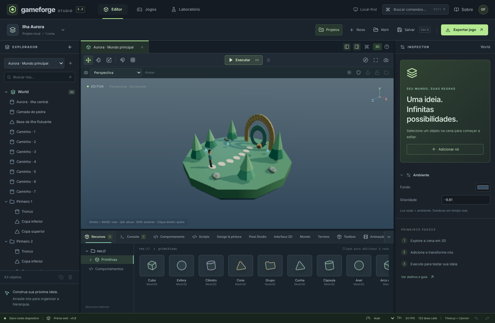
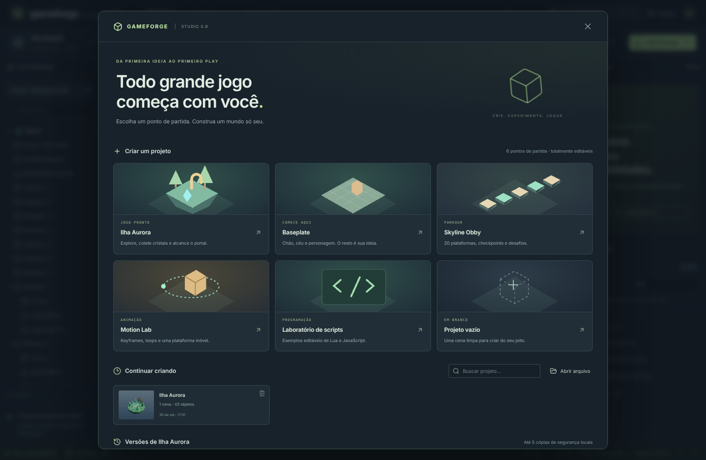
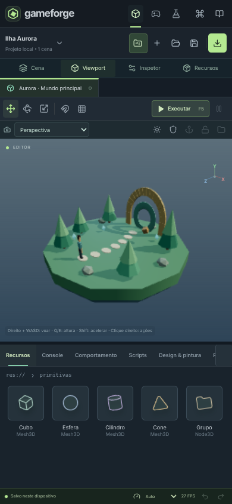
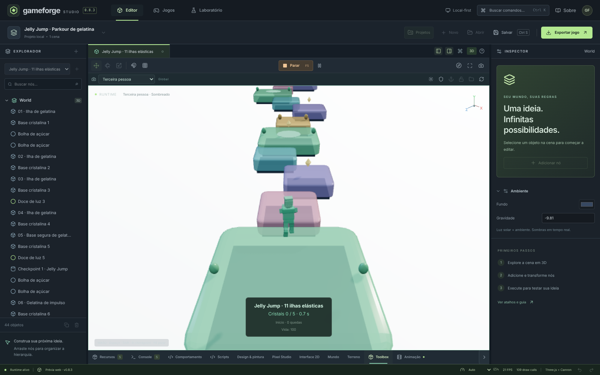
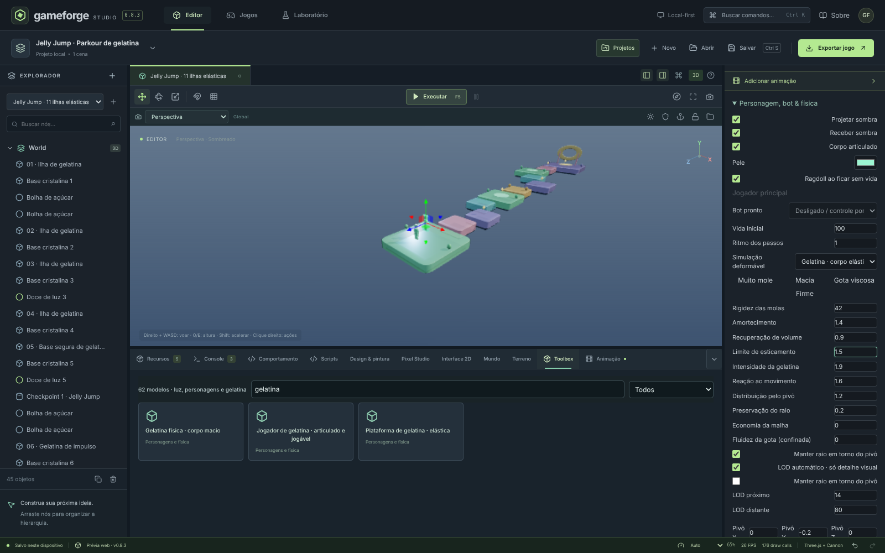
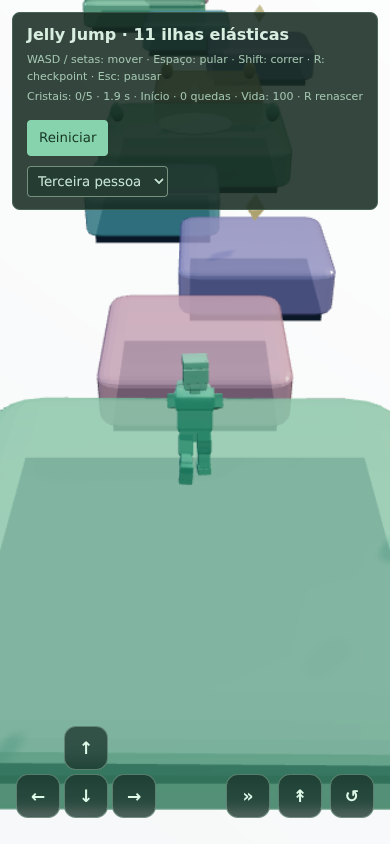

# GameForge Studio 0.8.3 · Braços corrigidos, volume tetraédrico e contato com malha

Um Studio **independente, inspirado no fluxo de criação do Roblox Studio**, construído sobre o código-fonte 0.7 fornecido: editor 3D, física, scripts, terreno, personagens e exportação offline. Interface em português, sem conta obrigatória.

> Não é Roblox, não importa `.rbxl`/`.rbxm`, não executa Luau e não oferece multiplayer ou serviços em nuvem. Lua 5.3 e JavaScript são as linguagens desta engine.

## Comece em cinco minutos

1. Abra **Projetos** e escolha **Jelly Jump**, **Ilha Aurora**, **Baseplate**, **Skyline Obby**, **Motion Lab**, **Laboratório de scripts** ou **Projeto vazio**.
2. Selecione objetos na cena/Explorador. Use **W / E / R** para mover, girar e escalar; **F** enquadra a seleção.
3. Adicione modelos na **Toolbox** ou busque um comando com **Ctrl+K**.
4. **F5** executa, **F8** volta à edição. WASD/setas, Espaço e Shift controlam o jogador; telas estreitas têm botões de toque.
5. **Ctrl+S** salva um projeto editável. **Exportar jogo** gera um HTML independente que pode ser aberto offline.

Guia completo: [docs/GUIA-STUDIO-0.8.md](docs/GUIA-STUDIO-0.8.md). Física atual e escopo: [docs/GELATINA-0.8.3.md](docs/GELATINA-0.8.3.md). Histórico: [0.8.2](docs/GELATINA-0.8.2.md) e [mapa/base 0.8.1](docs/GELATINA-0.8.1.md).

## GORE FORGE · jogo de demonstração completo

`goreforge.html` traz um sandbox de física em primeira pessoa no estilo **GoreBox**, feito
inteiramente com a engine atual (gelatina, ragdolls, fratura, explosões, partículas, decalques)
e uma UI 2D dirigida por dados. Serve para provar a física e o desenho da engine no limite:
pátio com 74 corpos dinâmicos, 12 rigs elásticos, gore com desmembramento real e um menu que
edita tema, HUD e presets de gore ao vivo.

```bash
npm run dev              # abra http://localhost:5173/goreforge.html
npm run build:goreforge  # arquivo único offline: entregas/goreforge.html (dá dois cliques)
npm run test:goreforge   # valida física, gelatina, fratura, tiro e tema no navegador
npm run installer:goreforge  # instalador Windows: entregas/GORE-FORGE-Instalador.cmd (arquivo único)
```

`GORE-FORGE-Instalador.cmd` é **um só arquivo** (~0,42 MB) com o jogo, o ícone e a lógica embutidos
em base64: dois cliques e instala — sem internet, sem descompactar, sem administrador. (O mesmo
conteúdo também sai como pacote ZIP, para quem prefere auditar arquivo por arquivo.)

O `.exe` de verdade (Electron + NSIS, com atalhos e desinstalador no painel de controle) segue o
mesmo plano que funcionou para o Studio, em `windows-latest`: empacota, **instala o próprio
instalador**, abre o jogo **a partir do executável instalado**, desinstala e publica a release
`goreforge-v<versão>` — e ficou pronto:

**Instalador GORE FORGE 0.8.3 entregue:** [baixar Windows x64](https://github.com/venomtids/GameForge/releases/download/goreforge-v0.8.3/GORE-FORGE-0.8.3-Windows-x64-Setup.exe)
· [release com checksum e instruções](https://github.com/venomtids/GameForge/releases/tag/goreforge-v0.8.3)
· [CI verde, ponta a ponta](https://github.com/venomtids/GameForge/actions/runs/37636204182). Tamanho
**112.721.242 bytes**, SHA-256 `0fcbc4cc1cb54c2bf30d7412642fb945cfcc6fce14dd429a4c9546311c9cb9dc`.
O CI instalou em silêncio (`/S` em `%LOCALAPPDATA%\Programs\GORE FORGE`), conferiu SHA-256, recursos,
atalho no Menu Iniciar e registro de desinstalação, jogou o jogo **pelo `.exe` instalado** (pátio,
física, tiro, spawn, dano, HUD, tela cheia, localStorage) e desinstalou provando que exe/atalho/registro
sumiram.

Para reproduzir/validar:

```bash
npm run desktop:goreforge        # no Windows: gera dist/windows-goreforge/*-Setup.exe + somas
npm run test:electron:goreforge  # abre e joga o jogo dentro do Electron (empacotado)
GOREFORGE_TEST_EXE="C:\...\GORE FORGE\GORE FORGE.exe" npm run test:electron:goreforge
                                 # ...ou contra o aplicativo INSTALADO, pelo executável
```

O instalador leve é um pacote pequeno e auditável (lançador `.cmd` + `Instalador.ps1` + o HTML): instala
por usuário em `%LOCALAPPDATA%\GORE FORGE`, cria atalhos na Área de Trabalho e no Menu Iniciar
(janela de aplicativo quando há Edge/Chrome), registra a desinstalação em *Aplicativos instalados* —
sem administrador e sem runtime nenhum. Para remover, use o próprio Windows ou
`Desinstalar GORE FORGE.cmd`. Validação: `npm run test:installer:goreforge`.

Estrutura de arquivos, decisões e como estender: [docs/GOREFORGE.md](docs/GOREFORGE.md).

## Correção dos braços e física volumétrica · 0.8.3

O personagem de gelatina agora dobra os cotovelos e ergue os braços **para a frente** ao andar/saltar. A primeira pessoa ganhou balanço contínuo, squash controlado e mãos em camada com profundidade própria, evitando o “flic” de braços/antebraços.

Após inspecionar os quatro repositórios indicados, acrescentamos **6 tetraedros com volume assinado/XPBD** à gaiola, preset **Gota viscosa** (pressão em um corpo fechado) e uma consulta de **ponto mais próximo por triângulo da malha deformada** para o jogador contra corpos de gelatina *livres*. Essa consulta complementa os colisores Cannon existentes, não os substitui: é discreta e aproximada no formato do jogador, não é FEM de material contínuo, água livre nem colisão global/CCD/IPC exato. Plataformas do parkour mantêm a superfície de apoio sólida, que não afunda.

**130 testes unitários**, build e testes de navegador `test:jelly`, `test:studio06`, `test:studio08` e `test:export:studio08` passaram. O teste offline móvel (390px) verifica pixels reais da cena depois do resize, não só o HUD; testes de braço por 1.000 passos rejeitam giros para trás/flicker. [Comparação dos quatro projetos, parâmetros, escopo real e limites](docs/GELATINA-0.8.3.md). **O instalador 0.8.3 foi instalado, validado e publicado**: [Windows x64](https://github.com/venomtids/GameForge/releases/download/studio-v0.8.3/GameForge-Studio-0.8.3-Windows-x64-Setup.exe) · [CI nativo](https://github.com/venomtids/GameForge/actions/runs/37501148172). A antiga 0.8.2 não contém essas correções.



## Gelatina mais mole e reativa · 0.8.2

Adaptados os algoritmos do [Jelly-Mesh-System de Roundy](https://github.com/roundyyy/Jelly-Mesh-System), com atribuição MIT: **molas por vértice**, reação à aceleração/rotação, pivô ajustável, falloff, recuperação radial e LOD visual. A geometria original é preservada, inclusive em esferas.

- **Muito mole / Macia / Firme** no inspector, com intensidade, reação ao movimento, pivô e economia de detalhe.
- Personagem com mais squash/stretch e oscilação nas articulações; plataformas reagem a carga, cisalhamento e impactos locais.
- Pés protegidos, topo visual coerente com o suporte e nenhuma acumulação do offset anterior de salto.
- Buffers de vértices únicos, orçamento de detalhe/normais e culling de malha oculta; **a física e as colisões não são desativadas pelo LOD**.
- Novos valores no jogador/plataformas da Toolbox e no Jelly Jump. Exportação HTML independente com a mesma física e avisos MIT.

**121 testes**, build e navegador de gelatina/Studio 0.6/0.8; percurso completo por controles reais a 30/60/144 cadências, saltos repetidos, mobile/offline e layout 320–1920. A gelatina continua uma aproximação híbrida, não FEM nem MeshCollider deformável exato. [Implementação, parâmetros, comparação e limites](docs/GELATINA-0.8.2.md).

## Correção de salto/colisão · 06/10/2026

Corrigido o personagem afundando visualmente nos blocos: a translação da animação elástica não acumula mais a cada salto. Contatos antigos não marcam o jogador como apoiado após lançamento, e as gelatinas agora escrevem profundidade para oclusão consistente. **110/110 testes**, build e testes de navegador de gelatina/Studio 0.6/0.8 passaram; prévia e HTML offline reconstruídos. [Reprodução e detalhes](docs/CORRECAO-SALTO-GELATINA.md). Essa correção foi incluída e validada no instalador Windows 0.8.2.

## Gelatina · atualização 0.8.1

- **Jelly Jump:** mapa pronto/editável, 11 superfícies gelatinosas, 2 checkpoints, 5 cristais, gelatina de impulso e portal. **Novo → Jelly Jump → F5**.
- **Toolbox → gelatina:** jogador articulado/jogável, plataforma elástica ancorada e corpo macio livre. Inserir um jogador o torna principal sem excluir os anteriores.
- **Física melhorada:** massa respeitada, molas, recuperação de forma/volume, limites de esticamento/impulso e colisão entre gelatinas. Apoios sólidos cedem ao peso e se recuperam.
- **Jogador híbrido:** colisor estável, joelhos/cotovelos animados e deformação por molas. Câmeras, corrida, salto, morte/renascimento e mãos em primeira pessoa continuam funcionando.
- **Entrada responsiva:** pulo/retorno capturados no evento, sem perder toques/teclas rápidos entre quadros; botão ↺ no celular. Campos de edição/salvamento preservam alterações imediatas.

**106/106 testes passaram**, incluindo a travessia completa com entradas a 30/60/144 FPS (sem teleporte), estabilidade, carga nos apoios e recuperação. Toolbox, câmeras, toque e exportação offline também passaram no navegador. Esses FPS são cadências de simulação/entrada, não garantia de desempenho em todo aparelho.

A gelatina é uma aproximação, não FEM/líquido volumétrico: o jogador não possui colisores individuais por membro e as plataformas usam apoio plano aproximado. Limite de 12 rigs físicos/elásticos ativos. [Detalhes técnicos](docs/GELATINA-0.8.1.md).

Projeto portátil: [Jelly-Jump-Gelatina.gameforge.json](examples/studio08/Jelly-Jump-Gelatina.gameforge.json).

## Recursos do Studio 0.8 preservados

- **Workspace responsivo:** Explorador/Inspetor redimensionáveis e recolhíveis; gavetas em telas estreitas; dock ajustável; preferências persistidas; atalhos de teclado e foco dos diálogos.
- **Qualidade adaptativa:** Auto, Econômica e Alta; ajuste gradual de resolução conforme o FPS observado. Céu físico opcional no editor; no jogo, respeita as configurações do mundo.
- **Seleção múltipla:** Ctrl/⌘ ou Shift+clique, copiar/colar, duplicar, agrupar/desagrupar, deslocar, alinhar e distribuir. Alterações em lote entram como uma operação no histórico.
- **Animação por keyframes:** posição, rotação e escala de objetos; interpolação linear/suave/degraus, duração, loops, prévia, captura de pose e reprodução no jogo/exportação. Plataformas estáticas animadas têm colisores cinemáticos.
- **Biblioteca local:** projetos recentes com miniaturas e versões nomeadas. Uma restauração primeiro cria **“Antes da restauração”**, para proteger a edição substituída.
- **Programação mais estável:** editor CodeMirror, diagnósticos, modelos de comandos, importação/exportação de scripts e recuperação de rascunhos ao trocar objetos/painéis na mesma sessão. Clique **Aplicar script** para gravar no projeto.
- **Desktop Electron:** menus em português, abrir arquivos pela linha de comando/associação, janela única, posição da janela, autosave em disco, salvamento atômico e `.bak`; renderer isolado, sem acesso direto a Node.js.
- **Exportação UTF-8:** nomes/textos com acentos e emojis; projeto limitado por bytes; runtime independente com controles de toque e qualidade automática.

A base anterior foi preservada: gizmos, hierarquia, snapping, câmeras ortográficas/perspectiva/FPS/terceira pessoa; física Cannon-es, humanoides, bots, ragdoll e gelatina; primitivas, modelos, terrenos contínuos/voxel e pintura; Pixel Studio, interfaces 2D, luzes, sombras, lanterna, céu e áudio sintetizado; jogos e laboratórios originais.

## Windows — usuário final

**Instalador atualizado 0.8.3 — entregue:** [baixar GameForge Studio para Windows x64](https://github.com/venomtids/GameForge/releases/download/studio-v0.8.3/GameForge-Studio-0.8.3-Windows-x64-Setup.exe) · [release/checksum/instruções](https://github.com/venomtids/GameForge/releases/tag/studio-v0.8.3). [Windows CI](https://github.com/venomtids/GameForge/actions/runs/37501148172) concluiu instalação NSIS e teste do **executável instalado**, inclusive salvamento UTF-8/backup, gelatina, IPC e exportação. Tamanho: **103.759.512 bytes**. SHA-256: `4d188ac60c79230a7b74811a6814e17b1e61e5cf643e1bcfc91f3c0d6021bf1e`. [Resumo desta entrega](ENTREGA-GELATINA-0.8.3.md). Prévia sem assinatura digital: confira a origem e o hash, sem desativar o antivírus.

### Versão anterior 0.8.2 (histórico)

**Instalador 0.8.2 (histórico):** [baixar Windows x64](https://github.com/venomtids/GameForge/releases/download/studio-v0.8.2/GameForge-Studio-0.8.2-Windows-x64-Setup.exe) · [release/checksum/instruções](https://github.com/venomtids/GameForge/releases/tag/studio-v0.8.2). **Gerado, instalado e validado no executável instalado** no [Windows CI](https://github.com/venomtids/GameForge/actions/runs/37466047048), incluindo abrir/salvar/backup, gelatina e exportação. 103.753.986 bytes, SHA-256 `598f6cb27b00190fb8a7f64687ed686bffc404ddf359f6a31d606272632c819d`. Esta versão contém a física 0.8.2 e a correção de salto; não inclui o ajuste posterior de braços/primeira pessoa/salvamento rápido 0.8.3. A 0.8.1 não teve publicação validada; a 0.8.0 abaixo é histórica.

[Resumo da entrega 0.8.2](ENTREGA-GELATINA-0.8.2.md). Prévia sem assinatura digital; confira a origem e o checksum, sem desativar o antivírus.

### Instalador anterior 0.8.0 (já entregue)

O alvo é **Windows 10/11 x64 (Intel/AMD)**. O pacote é um instalador Electron/NSIS:

`GameForge-Studio-0.8.0-Windows-x64-Setup.exe`

**Instalador gerado e validado em Windows CI:** [download da prévia Windows](https://github.com/venomtids/GameForge/releases/tag/studio-v0.8.0). O pacote inclui SHA-256 e instruções. Como alternativa, o [artefato da compilação validada](https://github.com/venomtids/GameForge/actions/runs/36748313262/artifacts/11113203349) contém o mesmo tipo de instalador (login GitHub; retenção de 30 dias).

A validação instalou o NSIS silenciosamente e testou o **executável instalado**, não apenas o código-fonte. [Execução completa](https://github.com/venomtids/GameForge/actions/runs/36748313262).

- Feche a engine e guarde backups antes de atualizar. Instale no mesmo usuário/pasta da versão anterior.
- O usuário final **não precisa de Node.js/Python**. Recomendação: 4 GB de RAM, WebGL2/aceleração gráfica e 600 MB livres.
- Instalador **não assinado**: o Windows pode mostrar aviso de reputação/SmartScreen. Verifique origem e SHA-256. Não desative o antivírus.
- Projetos/autosave não são apagados pela desinstalação. Identidade mantida: `com.gameforge.studio`.
- A associação é para `.gameforge`; `.gameforge.json` também pode ser aberto pelo botão Abrir. Não se modifica a associação global de todos os arquivos JSON.

Instruções: [packaging/LEIA-ME-WINDOWS.txt](packaging/LEIA-ME-WINDOWS.txt).

## Rodar o código-fonte

Node.js **24 LTS recomendado** (mínimo 22.12), npm e acesso à internet para instalar dependências:

```bash
npm ci
npm run dev
```

O `predev` reconstrói o player offline. Abra `http://localhost:5173` **no computador onde o servidor está rodando**. Em um servidor remoto, use o endereço público fornecido; não há API externa/localhost embutida no frontend.

```bash
npm test                    # testes de engine, migração, edição e armazenamento
npm run typecheck
npm run build               # player single-file + editor de produção
npm run preview             # produção local
npm run test:jelly           # Toolbox, personagem/mapa, câmeras e HTML offline
npm run test:goreforge       # GORE FORGE: física, gelatina, destruição, HUD e tema no navegador
npm run shots:goreforge      # capturas do GORE FORGE em test-results/
npm run installer:goreforge  # instalador único (.cmd) + pacote ZIP, em entregas/
npm run test:installer:goreforge # valida o instalador: arquivos, SHA256, ZIP e carga embutida
npm run desktop:goreforge    # .EXE real (Electron + NSIS): rode no Windows; o CI faz isso
npm run test:electron:goreforge # testa o jogo dentro do Electron (empacotado ou instalado)
npm run test:studio08        # fluxos do Studio; servidor dev precisa estar aberto
npm run test:export:studio08 # downloads + jogo file:// offline, Unicode e toque
npm run test:update          # regressões/scripts; servidor dev precisa estar aberto
npm run examples:studio08    # recria os projetos de exemplo 0.8
```

Testes de navegador usam Playwright. Instale Chromium com `npx playwright install chromium`; `CHROME_PATH` permite um navegador local. O helper tem fallback Linux para ambientes restritos. Não é necessário Playwright para o usuário final.

## Compilar o instalador no Windows

No Windows x64 com Node.js 24 LTS, dê dois cliques em **GERAR-INSTALADOR-WINDOWS.cmd**, ou execute:

```powershell
npm ci
npm test
$env:CSC_IDENTITY_AUTO_DISCOVERY = "false"
npm run desktop:win
```

Saída: `dist/windows/`. A compilação baixa Electron/NSIS; bloqueios de rede podem impedi-la. Não é preciso Wine ao compilar no Windows. `dist/desktop-app` contém somente assets compilados e o código do processo desktop, **sem node_modules de desenvolvimento**.

Para validar o aplicativo de produção sem instalar:

```powershell
npm run desktop:setup
$env:GAMEFORGE_TEST_APP = "dist/desktop-app"
npm run test:desktop:studio08
```

O CI Windows instala o NSIS em uma pasta temporária, verifica os recursos e testa o executável instalado antes de publicar. São testes automatizados em uma VM, com diálogos de arquivo simulados e sistema de arquivos real — não uma certificação em todo hardware Windows.

## Projetos, compatibilidade e limites

- Leitor migra formatos 2–6; formato atual continua **7**, com `animation` opcional. Preserve backups ao voltar para engines anteriores.
- Projetos até **8 MB UTF-8**, até 500 nós/cena; scripts até 128 mil caracteres/nó.
- Histórico: até 60 estados, limitado a cerca de 32 MB (sem contar o estado atual).
- Biblioteca: até 12 recentes (~40 MB). Versões: até 5/projeto e 25 no total (~60 MB), com remoção das mais antigas.
- Dados de navegador ficam no perfil/origem atual. Limpar dados do site remove a biblioteca. **Salve arquivos para backup/transferência.** IndexedDB é o fallback quando o armazenamento local pequeno está cheio; recupere pelo painel Projetos.
- Rascunhos de scripts são **da sessão**, não sobrevivem ao encerramento; apenas o código aplicado entra em projetos/versões/exportações.
- Keyframes não são animação de esqueleto/IK. Corpos dinâmicos, terrenos e malhas deformadas não usam keyframes no runtime. Escala visual não redimensiona colisores durante a animação. Transformações que causariam shear, excederiam os limites ou destruiriam uma animação são recusadas.
- Física discreta, sem CCD; modelos e interfaces são procedurais/simples. Sem importador glTF/FBX, editor 2D dedicado, colaboração em tempo real, marketplace, hospedagem ou monetização.
- Scripts executam em Worker com limites de tempo/instruções, mas **não constituem sandbox auditada**. Só permita código de confiança. A permissão nunca é herdada automaticamente de um arquivo.

Exemplos 0.8 em `examples/studio08/`. Documentação original, conservada como histórico: [docs/archive/README-0.7.md](docs/archive/README-0.7.md). Licenças de terceiros e fonte Inter: [THIRD-PARTY-NOTICES.txt](THIRD-PARTY-NOTICES.txt).

## Interface





Interface estreita, com painéis em gavetas (390 px):



### Jelly Jump






